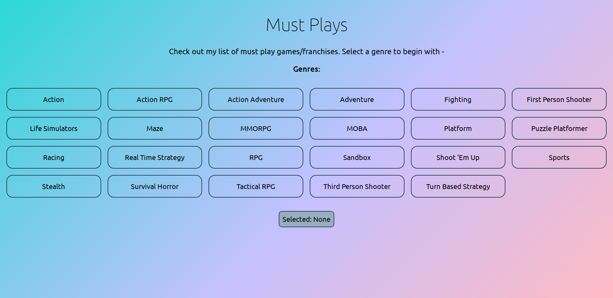

# Must Plays(MPs)

Are you a game lover ?

Or, would you rather prefer developing games ?

Then **[Must Plays](https://mustplays.netlify.app/)** can help you in getting an idea of what to play/develop next.

Why? you might ask; Well **Must Plays is a web app that lists the most legendary games of all time**. Now you might prefer only Action-Adventure or RPG or any other genre. Well whatever it might be MPs has got you covered.

Since MPs is a collection of the games that were most revolutionary in their approaches at their release times, you cannot go wrong with playing/developing any of the titles from this list.

Also feel free to have my ratings as a tie-breaker in case of any deadlocks you might experience.

_**Note** - If you feel that some title/s on the list is not according to current gen's taste, then please try to have a look into some of the modern titles of that same franchise. I tried to enlist most revolutionary game concepts, so it might suit you to find modern day titles of those franchises, since they might sound more polished in terms of modern day gameplay or do they ?_ :thinking:

This project was bootstrapped with [Create React App](https://github.com/facebook/create-react-app).

_PS: The data for this project has been extracted from [Wikipedia](https://en.wikipedia.org/wiki/List_of_video_games_considered_the_best). Check it out if you want to know more._
